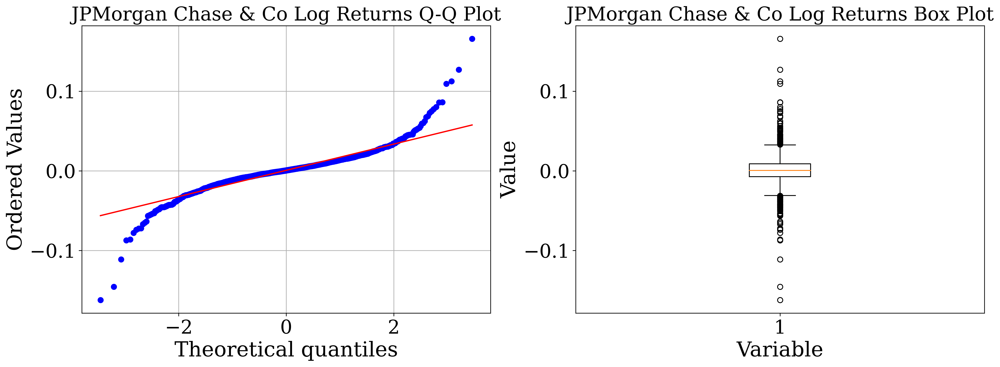
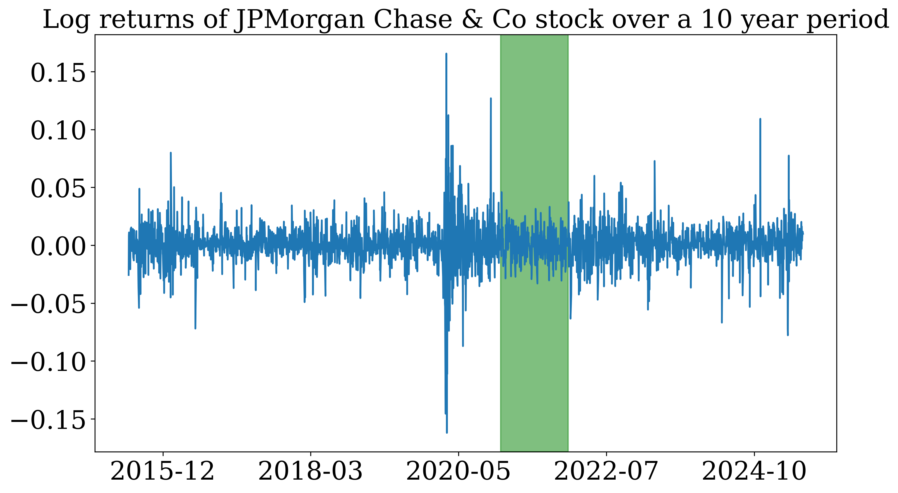
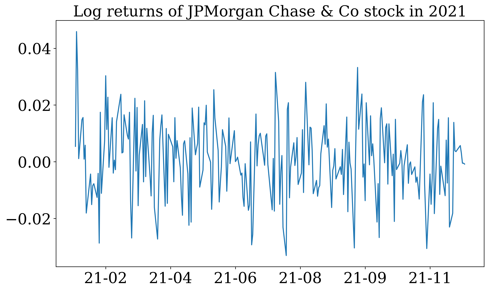
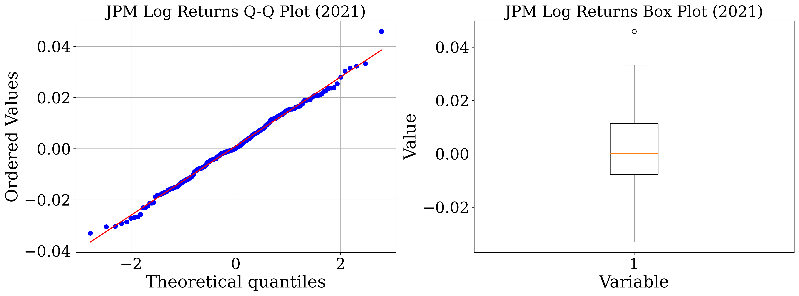
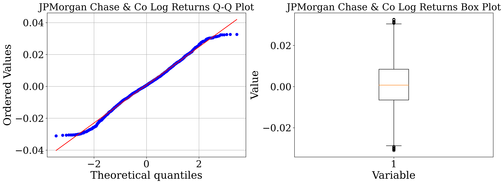

Have you ever heard that stock market returns (logarithmic returns to be precise) are supposed to follow that classic bell curve—the "normal distribution"? It's one of the key assumptions of financial math, making a lot of complex theories work neatly. But the real world market data feels a lot messier than a perfect bell curve, doesn't it?

So, in this blog, I decided to put this textbook theory to the test. Let's grab some real stock data and see if it actually behaves the way the models say it should. We'll be detectives, using a few simple graphical and statistical tools to uncover the truth.

### Graphical tests

Visual checks are a great first step to get a feel for the data. Today, we will be looking at two such tests.
    
- **Quantile-Quantile(Q-Q) plot**: With a Q-Q plot, the observed data's quantiles are plotted against the theoretical quantiles (normal distribution in our case). This one sounds complicated, but it's basically a "line-up" test. We ask our data's values to line up against where they should be in a perfect normal distribution (theoretical quantiles). If our data is truly "normal," the points on the plot will form a perfectly straight diagonal line. If they start wandering off—especially at the ends—it's a dead giveaway that something else is going on.
    
- **Box plot**: The box plot is a quick check for our data's symmetry. Imagine a perfectly balanced scale: the median line is the center point, and the box and whiskers are evenly spread on both sides. If one side is much longer than the other or the median is off-center, it’s a clear signal that our data is skewed and not following a normal distribution.

The main drawback of these tests, however, is that they're subjective—we're sometimes just eyeballing it. They don't give us a hard number to measure exactly how much our data deviates from normality. That's where statistical tests come in - they give us a clear, quantifiable result.

### Statistical tests
Statistical tests give us a clear mathematical verdict. They work by first assuming the data is normal and then calculating how likely it is we would see our particular dataset under that assumption.

This likelihood is called the p-value. In simple terms: if the p-value is low (less than 0.05), it means our data is a very bad fit for the normal distribution model. So, a low p-value gives us statistical proof that our data is not normal.

The specific test we'll be using in this blog is the [Shapiro-Wilk test](https://en.wikipedia.org/wiki/Shapiro–Wilk_test). Another popular statistical test is the [Kolmogorov-Smirnov test](https://en.wikipedia.org/wiki/Kolmogorov–Smirnov_test) which we'll not be using today. 

## Testing the evidence of normal distribution for JPMorgan Chase & Co 

For this test, I'm choosing JPMorgan Chase & Co (JPM), but you can follow along with any stock you're curious about! Just change the ticker from 'JPM' to something else (like 'AAPL' or 'TSLA') in the code below and see what you find.

### Let us import the necessary python modules

```python
import numpy as np
import pandas as pd
import matplotlib.pyplot as plt
import scipy.stats as stats
import seaborn as sns
import yfinance as yf 
import datetime as dt

# Setting global matplotlib parameters
import matplotlib as mpl
import matplotlib.dates as mdates 
mpl.rcParams["xtick.labelsize"] = 22
mpl.rcParams["ytick.labelsize"] = 22
mpl.rcParams['axes.titlesize'] = 22 
mpl.rcParams['figure.dpi'] = 300
mpl.rcParams['axes.labelsize'] = 24
mpl.rcParams['font.family'] = 'serif'
mpl.rcParams["mathtext.fontset"] = 'cm'

```

### Downloading 10 year of JPM data


```python
EndDate = dt.datetime.today()
StartDate = EndDate - pd.DateOffset(years=10)

JPMStockData = yf.download('JPM', start = StartDate, end = EndDate)["Close"]
JPMStockReturns = JPMStockData/JPMStockData.shift(1)
JPMStockLogReturns = np.log(JPMStockReturns.dropna())['JPM'].values
Dates = JPMStockReturns.dropna().index
```

### Let us plot the Q-Q and box plot of log returns of JPM stock using built-in plotting functions from statsmodel and matplotlib


```python
fig, axes = plt.subplots(1,2,figsize=(16, 6),dpi=300)

stats.probplot(JPMStockLogReturns, dist="norm", plot=axes[0])
axes[0].set_title("JPMorgan Chase & Co Log Returns Q-Q Plot")
axes[0].grid(True)
axes[1].boxplot(JPMStockLogReturns)
axes[1].set_xlabel("Variable")
axes[1].set_ylabel("Value")
axes[1].set_title("JPMorgan Chase & Co Log Returns Box Plot")
plt.tight_layout()
plt.show()
```
    

    

The Q-Q plot above shows the dots veering off the straight line, creating what analysts call "heavy tails." Think of these as the market's mood swings—the unexpectedly huge up and down days that the neat bell curve just can't predict. Let us further perform statistical tests.

### Shapiro-Wilk test


```python
pvalue = stats.shapiro(JPMStockLogReturns)[1]
print("Normality Test Results of JPMStockLogReturns stock (Shapiro-Wilk test):")
print(f"p-value = {pvalue}")
if pvalue < 0.05:
    print("Statistically significant evidence that the data is NOT normally distributed.")
else:
    print("No statistically significant evidence against normality.")
```

    Normality Test Results of JPMStockLogReturns stock (Shapiro-Wilk test):
    p-value = 2.453415772115319e-39
    Statistically significant evidence that the data is NOT normally distributed.


Our first verdict is here: Over the last 10 years, JPM's returns are anything but normal, and both our statistical and graphical tests confirms it. The culprit? Our 10-year data captures wild market swings from events like COVID and global conflicts, leading to extreme data points. This sparks an interesting question: could there be a calmer period, free from extreme market volatility, where JPM log returns actually align with a normal distribution? To check for such periods, let us plot JPM log returns over the last 10 years. 


```python
fig,ax = plt.subplots(figsize=(10,6),dpi=300)
ax.plot(Dates,JPMStockLogReturns)
plt.title("Log returns of JPMorgan Chase & Co stock over a 10 year period")
ax.xaxis.set_major_locator(plt.MaxNLocator(6)) 
ax.xaxis.set_major_formatter(mdates.DateFormatter('%Y-%m'))
StartDate = dt.datetime(2021,1,1)
EndDate = dt.datetime(2022,1,1)
ax.axvspan(StartDate, EndDate, alpha=0.5, color='green')
plt.tight_layout()
plt.show()
```
    


Just look at this plot of the returns over time. You can literally see the wild swings from the COVID crash in 2020 and recent global conflicts.

But wait... see that green highlighted area in 2021? It looks much calmer. This got me thinking: maybe the normality assumption isn't completely wrong, it just doesn't work when the market is having a meltdown. What if we zoom in on that quiet period? Let's investigate!

### Let us download the data for JPMorgan Chase & Co during the highlighted area (2021)

```python
JPMStockDataCustom = yf.download('JPM', start = StartDate, end = EndDate)["Close"]
JPMStockReturnsCustom = JPMStockDataCustom/JPMStockDataCustom.shift(1)
JPMStockLogReturnsCustom = np.log(JPMStockReturnsCustom.dropna())['JPM'].values
DatesCustom = JPMStockReturnsCustom.dropna().index
```

```python
fig,ax = plt.subplots(figsize=(10,6),dpi=300)
ax.plot(DatesCustom,JPMStockLogReturnsCustom)
ax.xaxis.set_major_locator(plt.MaxNLocator(7)) 
ax.xaxis.set_major_formatter(mdates.DateFormatter('%y-%m'))
plt.title("Log returns of JPMorgan Chase & Co stock in 2021")
plt.tight_layout()
plt.show()
```
    

    

### Q-Q  and box plot - log returns of JPMorgan Chase & Co (2021)
```python
fig, axes = plt.subplots(1,2,figsize=(16, 6),dpi=300)

stats.probplot(JPMStockLogReturnsCustom, dist="norm", plot=axes[0])
axes[0].set_title("JPM Log Returns Q-Q Plot (2021)")
axes[0].grid(True)
axes[1].boxplot(JPMStockLogReturnsCustom)
axes[1].set_xlabel("Variable")
axes[1].set_ylabel("Value")
axes[1].set_title("JPM Log Returns Box Plot (2021)")
plt.tight_layout()
plt.show()
```
    


### Shapiro-Wilk test - Log returns of JPMorgan Chase & Co (2021)
```python
pvalue = stats.shapiro(JPMStockLogReturnsCustom)[1]
print("Normality Test Results of JPMorgan Chase & Co stock (Shapiro-Wilk test):")
print(f"p-value = {pvalue}")
if pvalue < 0.05:
    print("Statistically significant evidence that the data is NOT normally distributed.")
else:
    print("No statistically significant evidence against normality.")
```

    Normality Test Results of JPMorgan Chase & Co stock (Shapiro-Wilk test):
    p-value = 0.7530741691589355
    No statistically significant evidence against normality.

We are in for suprising results! The dots in the Q-Q plot have lined up and the p-value is 0.75. That's a huge number, and it means we have no evidence to say the data isn't normal. It seems we found a 'normal' year for JPM. This is fascinating! It suggests that the normality assumption might hold up, but only in very specific, stable market conditions. This raises a compelling question for future exploration: what market conditions in 2021 fostered this normality, and can they be replicated in other stable periods? These questions are interesting future endeavors. 

## Further investigation: Trimming extremal values from the dataset

This got me thinking: we know the extreme market events are skewing our results. So what if we just removed them? If we trim off the most extreme daily returns, will the remaining "calmer" data finally follow a normal distribution?

To find out, we'll use the box plot itself to define what counts as "extreme." The plot's "whiskers" create a boundary for the bulk of the data. Any data point that falls outside those whiskers is considered an outlier. We'll chop off those pesky outliers and test the data that's left.

### We are re-plotting the JPM log returns over last 10 years to extract whiskers

```python
fig, axes = plt.subplots(1,2,figsize=(16, 6),dpi=300)

stats.probplot(JPMStockLogReturns, dist="norm", plot=axes[0])
axes[0].set_title("JPMorgan Chase & Co Log Returns Q-Q Plot")
axes[0].grid(True)
WhiskersBoxPlot = axes[1].boxplot(JPMStockLogReturns)["whiskers"]
axes[1].set_xlabel("Variable")
axes[1].set_ylabel("Value")
axes[1].set_title("JPMorgan Chase & Co Log Returns Box Plot")
plt.tight_layout()
plt.show()
```


    

### We are extracting the whiskers (threshold) from the box plot


```python
LowerWhisker = WhiskersBoxPlot[0].get_ydata()[1]
UpperWhisker = WhiskersBoxPlot[1].get_ydata()[1]
print(f"The lower and upper threshold for extremal values are {LowerWhisker:.4f} and {UpperWhisker:.4f}")
```

    The lower and upper threshold for extremal values are -0.0310 and 0.0326

### Let us remove the extremal value from the log returns 

```python
Mask = np.where((JPMStockLogReturns <= UpperWhisker) & (JPMStockLogReturns >= LowerWhisker))
JPMStockLogReturnsTrimmed = JPMStockLogReturns[Mask]
```

### Let us re-plot the JPM log returns over last 10 years omitting the extremal data

```python
fig, axes = plt.subplots(1,2,figsize=(16, 6),dpi=300)

stats.probplot(JPMStockLogReturnsTrimmed, dist="norm", plot=axes[0])
axes[0].set_title("JPMorgan Chase & Co Log Returns Q-Q Plot")
axes[0].grid(True)
WhiskersBoxPlot = axes[1].boxplot(JPMStockLogReturnsTrimmed)["whiskers"]
axes[1].set_xlabel("Variable")
axes[1].set_ylabel("Value")
axes[1].set_title("JPMorgan Chase & Co Log Returns Box Plot")
plt.tight_layout()
plt.show()
```
    


### Shapiro-Wilk test - Log returns of JPMorgan Chase & Co (Omitting the extremal values)


```python
pvalue = stats.shapiro(JPMStockLogReturnsTrimmed)[1]
print("Normality Test Results of JPMorgan Chase & Co stock (Shapiro-Wilk test):")
print(f"p-value = {pvalue}")
if pvalue < 0.05:
    print("Statistically significant evidence that the data is NOT normally distributed.")
else:
    print("No statistically significant evidence against normality.")
```

    Normality Test Results of JPMorgan Chase & Co stock (Shapiro-Wilk test):
    p-value = 7.01930446211918e-07
    Statistically significant evidence that the data is NOT normally distributed.

Interesting results! Even after omitting the extreme values, JPM's log returns still refuse to conform to a normal distribution. This reveals a critical insight: the normality hypothesis does not just crumble under extreme market events—it falters even in calmer waters. We must critically analyze into factors like distribution skewness and question the assumption that daily log returns are independent and uncorrelated. While assuming normality simplifies the math, it strays far from reality, urging us to rethink our models to mimick the true stock behavior.

## Conclusion

So, where does this leave us? My journey down this rabbit hole has shown me that the 'normal distribution' of stock returns is more of a myth than a reality, at least over the long run. Even when we carefully removed the most extreme outliers, the data still refused to play by the rules. For me, the biggest takeaway is this: the outliers and the chaos in the data aren't just noise to be ignored. They are the story. Relying on simplified models that assume a perfect, well-behaved world can be misleading. 

Thanks for reading! I hope you enjoyed this blog as much as I did. 
